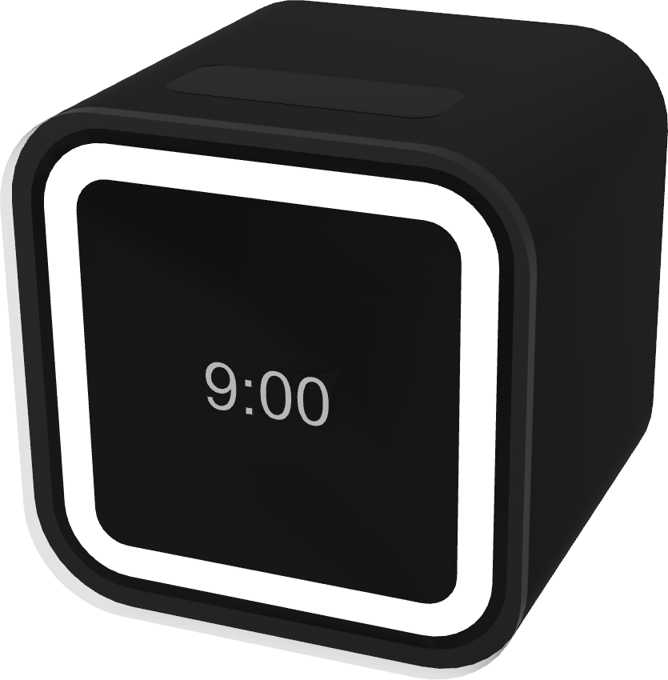
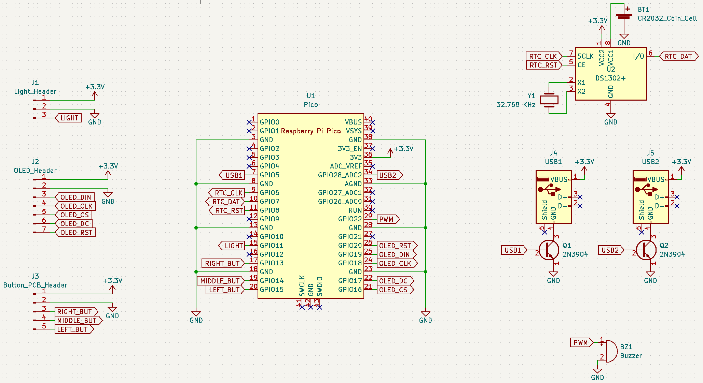
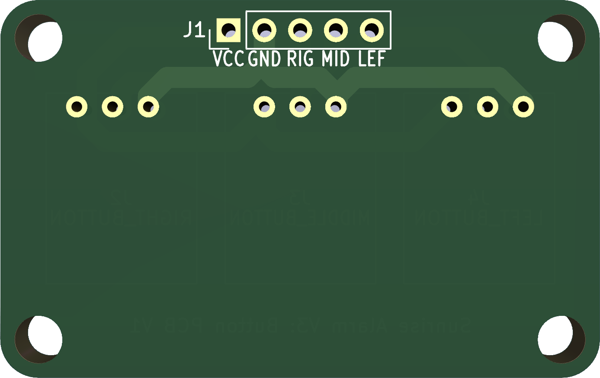
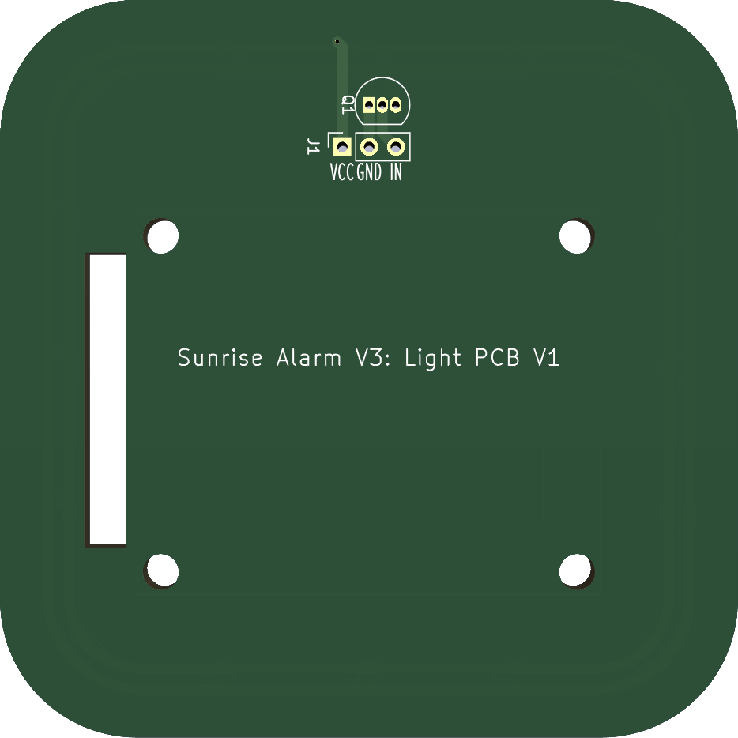
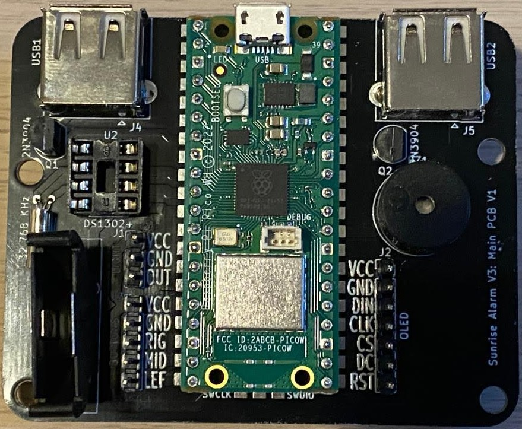
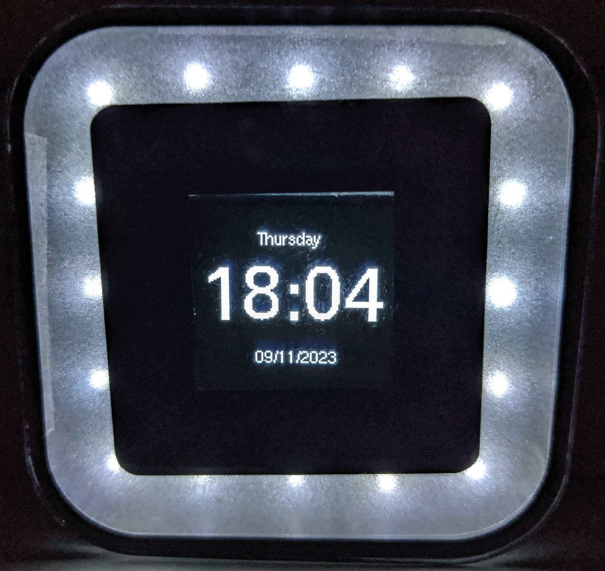

# Sunrise Alarm Clock V3

**Table of Contents**

- [Introduction](#introduction)
- [Brief](#brief)
- [Development Roadmap](#development-roadmap)
- [Circuitry](#circuitry)
  - [Schematics](#schematics)
    - [Main PCB](#main-pcb)
    - [Button PCB](#button-pcb)
    - [Light PCB](#light-pcb)
  - [PCB Design](#pcb-design)
    - [Main PCB](#main-pcb-1)
    - [Button PCB](#button-pcb-1)
    - [Light PCB](#light-pcb-1)
  - [Soldering](#soldering)
    - [Main PCB](#main-pcb-2)
    - [Button PCB](#button-pcb-2)
    - [Light PCB](#light-pcb-2)
- [Enclosure](#enclosure)
  - [CAD Enclosure](#cad-enclosure)
  - [Assembled Enclosure](#assembled-enclosure)
- [Code](#code)
  - [Documentation](#documentation)
- [Further Work](#further-work)

## Introduction

This is the third version of the "Sunrise Alarm Clock" project. [The first version](https://github.com/SeanP2001/Arduino_Sunrise_Alarm_Clock) used an Arduino Mega and an LCD keypad shield. [The second version](https://github.com/SeanP2001/Sunrise_Alarm_Clock_V2) used a Wemos D1 mini (ESP8266) and 0.96" OLED on a single custom PCB. This design was fully functional but it did not look like an alarm clock. I started version 3 with the aim of making the alarm look more premium. 

    
    
    

<i>Alarm V1, Alarm V2 and Alarm V3 Concept</i>

This project was sponsored by PCBWay. To order high-quality, custom PCBs go to [PCBWay.com](https://www.pcbway.com/)

## Brief

The alarm needed to:
- Tell the time
- Use a real-time clock (RTC) to keep the time 
- Use an NTP server to update the time periodically
- Include a larger, 1.5" OLED 
- Include three capacitive touch buttons
- Include two timed USB ports
- Include a bright ringlight on the clock face
- Include a buzzer
- Have a premium feel

## Development Roadmap

The following roadmap outlines the planned milestones for the project. Each step includes testing and documenting.

| **Version**   | **Description**                                            |
|---------------|------------------------------------------------------------|
| V3.1-alpha    | Capture Schematic                                          |
| V3.2-alpha    | Design Main PCB                                            |
| V3.3-alpha    | Design Light PCB                                           |
| V3.4-alpha    | Design Button PCB                                          |
| V3.5-alpha    | Design and Fabricate Enclosure                             |
| V3.6-alpha    | Solder and Assemble                                        |
| V3.7-alpha    | Test Hardware and Document                                 |
| V3.8-alpha    | Program Inputs and Outputs                                 |
| V3.9-alpha    | Implement App Infrastructure                               |
| V3.10-alpha   | Develop Alarm App                                          |
| V3.11-alpha   | Develop Light App                                          |
| V3.12-alpha   | Develop USB App                                            |
| V3.13-alpha   | Develop Settings App                                       |
| V3.14-alpha   | Implement WiFi, NTP Time Sync and Settings Portal          |
| V3.0-release  | Initial Release (Document, Test and Fix Bugs)              |

## Circuitry

### Schematics

#### Main PCB

  

#### Button PCB

  

#### Light PCB

  

### PCB Design

#### Main PCB

    
    

<i>Main PCB Front and Back</i>

#### Button PCB

    
    

<i>Button PCB Front and Back</i>

#### Light PCB

    
    

<i>Light PCB Front and Back</i>

### Soldering

I was really impressed by the quality of the PCBs sent by PCBWay. To order high-quality, custom PCBs go to [PCBWay.com](https://www.pcbway.com/). 

#### Main PCB

    
    

<i>Main PCB Front and Back</i>

  

<i>Main PCB Soldered</i>

#### Button PCB

    
    

<i>Button PCB Front and Back</i>

  

<i>Button PCB Soldered</i>

#### Light PCB

    
    

<i>Light PCB Front and Back</i>

  

<i>Light PCB Soldered</i>

## Enclosure

### CAD Enclosure

    
    
    

    
    
    

### Assembled Enclosure

    
    

    
    

## Code

### Documentation

View the Doxygen documentation for this project [here](https://raw.githack.com/SeanP2001/Sunrise_Alarm_Clock_V3/main/Code/Documentation/html/index.html).

## Further Work

In future I would like to;
- Change the design to not use vinyl as it is difficult to get a perfect result using it.
- Add software functions:
  - Wake up games
  - Daily weather forecast
  - Daily calendar events
  - Log sleep and wake times
  - Mood tracker
  - Habit tracker